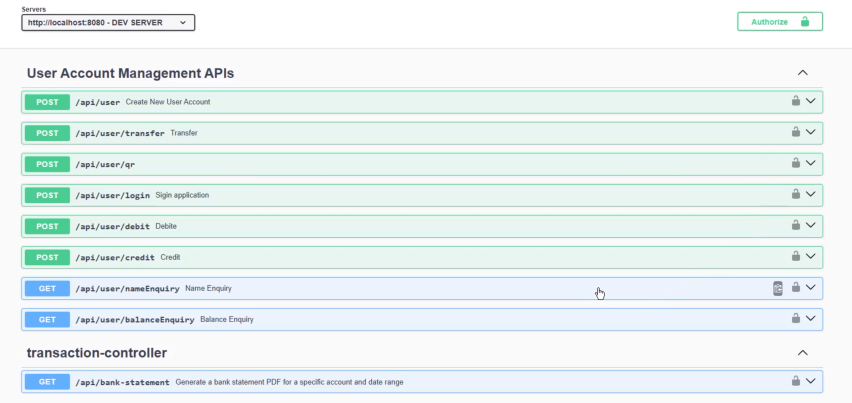

# 🏦 API de Servicios Bancarios

API REST desarrollada en **Spring Boot** que permite realizar operaciones bancarias como **transferencias**, **créditos**, **débitos**, autenticación de usuarios y envío de **reportes por correo electrónico**.

### Swagger de la api :


## 🚀 Características

- Registro y autenticación de usuarios (JWT)
- Operaciones bancarias:
  - Transferencias entre cuentas
  - Crédito a cuenta
  - Débito desde cuenta
- Envío de reportes por correo
- Manejo de errores y validaciones
- Arquitectura RESTful

## 📦 Tecnologías

- Java 17+
- Spring Boot 3
- Spring Security
- JWT (JSON Web Token)
- Spring Data JPA
- MySQL
- JavaMailSender
- Swagger *(opcional, no todos los endpoints son compatibles)*

## ⚙️ Instalación

```bash
# Clona el repositorio
git clone https://github.com/juniorDeveloper8/BankService.git

# Abre con tu editor de preferencia
# Configura tu base de datos en application.properties
# Ejecuta la aplicación
./mvnw spring-boot:run

```
# 🔧 Configuración necesaria antes de ejecutar

Para que la aplicación funcione correctamente, es necesario configurar las variables sensibles en el archivo application.properties ubicado en src/main/resources/.
Ejemplo de contenido para application.properties:     

```
spring.application.name=bank

spring.jpa.hibernate.ddl-auto=update
spring.datasource.url=jdbc:mysql://localhost:3306/bankdb
spring.datasource.username=tu_usuario_db
spring.datasource.password=tu_password_db
spring.datasource.driver-class-name=com.mysql.cj.jdbc.Driver
spring.jpa.show-sql=true
spring.jpa.properties.hibernate.dialect=org.hibernate.dialect.MySQL8Dialect

spring.mail.host=smtp.gmail.com
spring.mail.port=587
spring.mail.username=tu_correo@gmail.com
spring.mail.password=tu_password_correo

spring.mail.properties.mail.smtp.auth=true
spring.mail.properties.mail.smtp.starttls.enable=true

app.jwt-secret=tu_clave_secreta_jwt
app.jwt-expiration=3600000

```
> ⚠️ **Nota:**  
> Para Gmail, se recomienda generar una **contraseña de aplicación** desde la configuración de seguridad de tu cuenta Google y usar esa en lugar de tu contraseña habitual.  
> Esto permite que la aplicación pueda enviar correos sin comprometer tu contraseña real.

>spring.mail.username=tu_correo@gmail.com
>spring.mail.password=tu_password_app

